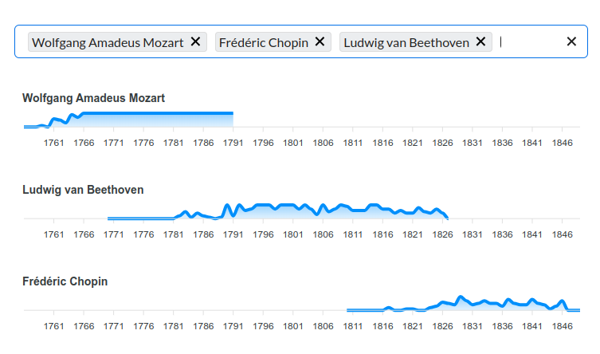

# Composer timelines

This web app (live [here on Github pages](https://zulko.github.io/composer-timelines/?selectedComposers=Giacomo+Puccini%2CGiuseppe+Verdi%2CGaetano+Donizetti%2CGioachino+Rossini%2CVincenzo+Bellini)) displays timelines of events and works for selected composers. Ever wondered what Verdi was up to when Puccini composed his first opera? This app is for you!

The project relies extensively on the ChatGPT API for building an event database from Wikipedia, which makes it extremely easy to add a new composers (see [this write-up](https://github.com/Zulko/composer-timelines/blob/main/docs/write-up.md))

<center></center>

## Adding/requesting more composers

Any classical composer with public-domain work from before 1950 is of interest to this project.

### Manually

To add a composer, all you need to do is add a `COMPOSER NAME.json` in `data/composer_data`, and add an entry for the composer in `composers.json`.

### Via a python script

This can be done by hand through your own research, or automated with ChatGPT via this script:

```bash
# python3 -m pip install -r data_collection/requirements.txt
python3 data_collection/add_composer.py --composer="Anatoly Lyadov" --target=public/data/
```

### Via the github actions button (repo admin only)

Go to `Actions > Workflows > Add a composer` ([here](https://github.com/Zulko/composer-timelines/actions/workflows/add_composer.yml)) click `Run workflow` and enter the (full) name of the composer to add. The pipeline will look the composer up on Wikipedia and IMSLP and generate a Pull Request to add the composer's data to the project. 

Prerequisites:
- Set `OPENAI_AI_KEY` as your Github repository secret.
- Go to `Settings > Actions > General > Workflow permissions` and make sure you give *"Read and write permissions"* and *"Allow GitHub Actions to create and approve pull requests"*.

### Via a PR

PRs are encouraged (one composer per request please). You can also request new composers by opening an Issue in this Github repo, or [emailing me](mailto:valentin.zulkower+@gmail.com?subject=Composer%20timelines%3A%20new%20composers%20request").

## Running the app locally

Run the project with:

```bash
npm install
npm run dev
```

Navigate to [localhost:8080](http://localhost:8080). You should see your app running. Edit a component file in `src`, save it, and the changes should appear live in the app.

If you're using [Visual Studio Code](https://code.visualstudio.com/) we recommend installing the official extension [Svelte for VS Code](https://marketplace.visualstudio.com/items?itemName=svelte.svelte-vscode). If you are using other editors you may need to install a plugin in order to get syntax highlighting and intellisense.

To create an optimised version of the app:

```bash
npm run build
```
