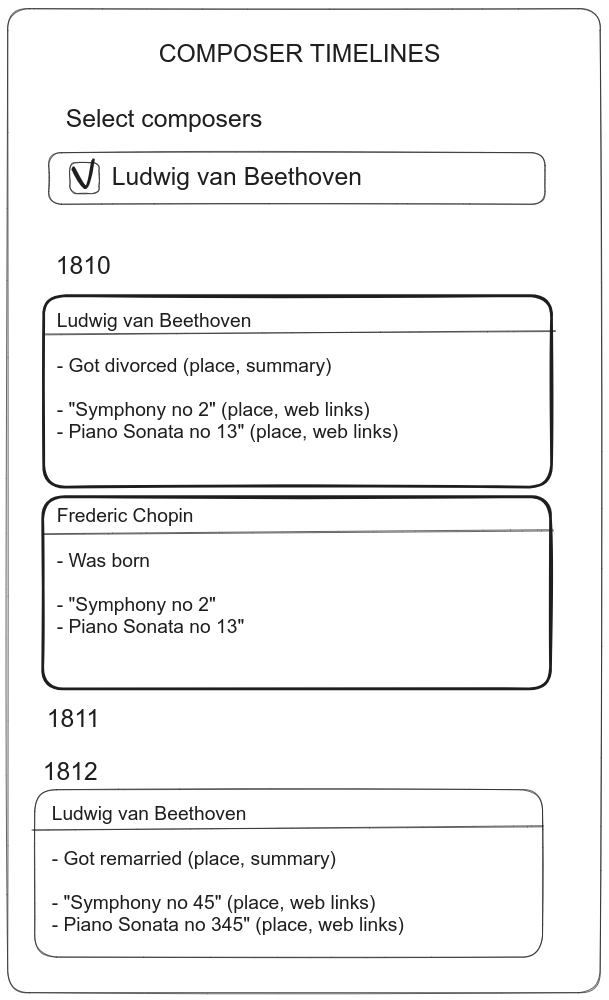

# Building a database of classical composer's life events with ChatGPT and GPT4

These are notes on the development of [this website], where users can compare the year-by-year timelines of classical composers (ever wondered what Mozart was up to when Beethoven composed his first Sonata?). I have built many such apps and I probably can do better in a couple hours than a beginner could do in a week. But now so can ChatGPT, and under a minute!

To test how close the new GPT wonderbots are from stealing all of our jobs, I tried building the project using ChatGPT/GPT4/copilot every chance I got.

Synopsis:

- In a jupyter notebook, using Python:
  - I generate a list of composers of interests
  - I ask ChatGPT to generate a database of events (from its "memory") for these composers. But I'm too afraid to trust the results.
  - I scrape the composer wikipedia pages with GPT4 to generate a database of their life events.
  - I also GPT4-scrape all wikipedia pages corresponding to years 1500 to 2000, to get a database of world events.
  - Finally I scrape IMSLP to get lists of compositions (and links to sheet music)
- Finally I (but really ChatGPT) build a simple static webpage displaying that data, so it can be hosted on Github Pages.

## Step1: building the database

### Getting ChatGPT to answer in Python 

Since I am going to use Python to automate the building of my database, I start with this very useful function that allows me to ask GPT4 something in plain english, and get an answer that is a valid python object (like a list or a dict) that I can iterate through easily.

```python
import openai

openai.api_key = os.environ["OPENAI_KEY"]

system_prompt = """
All your answers should be valid a python objects (list, dict, etc.)
Your answers should have no introduction and no markdown formatting
"""

def ask_chatgpt_with_pythonic_output(query):
    """Return a ChatGPT answer as a python object (list, dict, etc.)"""
    response = openai.ChatCompletion.create(
        model="gpt-4o",
        messages=[
            {"role": "system", "content": system_prompt},
            {"role": "user", "content": query}
        ]
    )
    return eval(response['choices'][0]['message']['content'])
```

In practice you need some guardrails around that function:
- ChatGPT may occasionally overlook the "valid python" part, which causes the `eval()` to fail. The good news is that ChatGPT gives different answers when you ask a same question twice, and simply asking a second (or a third) time will resolve the problem.
- ChatGPT has a limit on the output size which will cause it to stop mid-way through the generation of a list, which fails that function.

### What composers should I have in my database? Ask ChatGPT!

Let's ask:

```python
prompt = """
Give me a list of the full names of the most famous classical composers.
Only include composers born after 1500 and dead before 1976.
Make sure the list has more than 100 composers.
"""
composers_list = ask_chatgpt_with_pythonic_output(prompt)

> ["Johann Sebastian Bach", "Ludwig van Beethoven", "Wolfgang Amadeus Mozart", ...]
```

And just like that, instead of going through the effort of doing my own research or using my own critical judgment, I get the content of my website decided for me!

Sure, GPT4's answer is not exactly what I asked for: it has 105 composers instead of exactly 100, it lists authors that definitely died after 1976 despite my request (Piazzolla, Bernstein), and it includes a few definitely-not-famous names (Spohr, Sullivan...) while some big shots were left out (Puccini, Haendel, Paganini...). But it's ok, I'll remove the most recent composers with a Python loop, and when I have a first version of the website, I'll add another batch of composers by asking *"List the 50 most famous composers (living between 1500 and 1976) not in this list: {first_list}"*. 

### Can you ask GPT4 for biographical and historical details?

Is GPT4 basically google? In the hundreds of billions of parameters that form its model, can one find all of wikipedia (which is, in comparison, only 5 billion words across 7 million articles) and all the knowledge of the internet?

For my timeline database, I'll need lists of the composer's life events, lists of their works with year of publication, and lists of world events by year.

Let's start with world events:

```python
ask_chatgpt_with_pythonic_output("""
List 20 major events of 1791 across politics, music, and science.
""")

> [
 {'event': 'U.S. Bill of Rights ratified', 'category': 'politics'},
 {'event': 'Haitian Revolution begins', 'category': 'politics'},
 {'event': 'Poland adopts May 3rd Constitution', 'category': 'politics'},
 {'event': 'Wolfgang Amadeus Mozart dies', 'category': 'music'},
 {'event': 'The Magic Flute premieres', 'category': 'music'},
 {'event': 'First performance of Symphony No. 96 by Joseph Haydn',
  'category': 'music'},
 {'event': 'Constitution of 1791 in France', 'category': 'politics'},
 {'event': 'First Bank of the United States opens', 'category': 'politics'},
 {'event': 'Michael Faraday joins the Royal Institution',
  'category': 'science'},
 {'event': 'Slave revolt in Saint-Domingue', 'category': 'politics'}
]
```

They all check out! Every time I run this, I get different events, and different data structures, but as long as ChatGPT doesn't lie to us, we could run this query for all years between 1500 and 2000 and get a year-by-year timeline of marking events.


Next let's try life events, and let's enforce a data schema through the prompt:

```python
ask_chatgpt_with_pythonic_output("""
List the main events in the life of Pergolesi.
Each event has the schema
{event, summary, year, city, country}
List at least 10 events.
The summary should have a few sentences,
and be as informative as possible.
""")
```

```python
[{'event': 'Birth',
  'summary': """Giovanni Battista Pergolesi was born into a modest
  family. His musical talent became evident early in his childhood.""",
  'year': 1710,
  'city': 'Jesi',
  'country': 'Italy'},
 ...
 {'event': 'Early Compositions',
  'summary': """Around this time, Pergolesi began composing sacred
  music, cantatas, and instrumental pieces, showcasing his rapidly
  developing talent.""",
  'year': 1723,
  'city': 'Naples',
  'country': 'Italy'},
 ...
 {'event': "Composes 'Stabat Mater'",
  'summary': """One of his most famous works, 'Stabat Mater',
             was composed during this period, commissioned
             by the Confraternity of San Luigi di Palazzo.""",
  'year': 1736,
  'city': 'Naples',
  'country': 'Italy'},
 ]
```

Here again, it all checks out against Wikipedia! And you can ask for more details with a bit of prompt tuning. For instance if the system prompt says *"You are a scholar specialized in the lives of famous composers"* and then I ask for more details in my query:


```python
ask_chatgpt_with_pythonic_output("""
List the main events in the life of Franz schubert,
with much detail on each event.
Each event has the schema
{event, summary, year, city, country}
List at least 10 events.
The summary should have a few sentences,
and be as informative as possible.
""")

> [
  {'event': 'Birth',
   'summary': """Franz Schubert was born on January 31, 1797, in
    Himmelpfortgrund, a small suburb of Vienna, to Franz Theodor Florian
    Schubert and Maria Elisabeth Katharina. His father was a schoolmaster
    and his mother was a housemaid. Schubert showed early musical talent
    and was encouraged by his family.""",
  'year': 1797, 'city': 'Vienna', 'country': 'Austria'},
 {'event': 'Early musical education',
  'summary': """Schubert's father and brother gave him his first lessons in
  piano and violin. Recognizing his prodigious talent, his family enrolled
  him in the Imperial Court Chapel, where he sang in the choir and received a
  rigorous musical education under Antonio Salieri.""",
  'year': 1808,
  'city': 'Vienna',
  'country': 'Austria'},
 {'event': 'First compositions',
  'summary': '''At a young age, Schubert began composing music. Among his
  earliest works are string quartets and his first symphony, composed when he
  was just 16. His growing portfolio included songs, chamber music, and
  orchestral works.''',
  'year': 1813,
  'city': 'Vienna',
  'country': 'Austria'},
```

Let's be honnest, that's close to perfect for a database of biographical events. Everything is clear, informative, contextualized. So by running this on all my composers, I could build myself a small catalogue of composer life events in a matter of minutes. No scraping the internet, no curation, just ask GPT4 for a brain dump!

GPT4 is actually so good at events, you can even ask something like this:

```python
ask_chatgpt_with_pythonic_output("""
What was wagner doing when Bizet was composing Carmen?
""")

> {
  'Wagner': {
    'activities': [
      "working on his opera 'Parsifal'",
      "completing 'Götterdämmerung'"
    ],
    'timeline': """Carmen was composed between 1873 and 1875;
                 during this time, Wagner was primarily occupied
                 with his final works"""
  }
}
```

This is true as far as I can tell, although this was an easy one, Wagner spent half of his career working on Parsifal and Götterdämmerung.

Now let's try with lists of works:

```python
ask_chatgpt_with_pythonic_output("""
List the main works of Alexandre Scriabin with their year
and place of publication or composition.
Each work has the schema {title, year, city, country}
""")

[{'title': 'Piano Sonata No. 1',
  'year': -5,
  'city': 'Moscow',
  'country': 'Russia'},
 {'title': 'Piano Sonata No. 2',
  'year': -5,
  'city': 'Moscow',
  'country': 'Russia'},
 ...
 {'title': 'Piano Sonata No. 8',
  'year': -1,
  'city': 'Moscow',
  'country': 'Russia'},
 {'title': 'Piano Sonata No. 9',
  'year': -1,
  'city': 'Moscow',
  'country': 'Russia'},
 {'title': 'Piano Sonata No. 10',
  'year': 1913,
  'city': 'Beaulieu-sur-Mer',
  'country': 'France'},
 {'title': 'Symphony No. 1',
  'year': -1,
  'city': 'Moscow',
  'country': 'Russia'},
 {'title': 'Symphony No. 2',
  'year': 1901,
  'city': 'Moscow',
  'country': 'Russia'},
 {'title': 'The Poem of Ecstasy',
  'year': -3,
  'city': 'Moscow',
  'country': 'Russia'},
 {'title': 'Prometheus: The Poem of Fire',
  'year': -2,
  'city': 'Brussels',
  'country': 'Belgium'}]
```

Wow! Wow wow wow what a mess. We knew they can happen: we've finally met an hallucination! The years are nonsensical, the places also dubious (I don't think Scriabin had any connection to Beaulieu-Sur-Mer), and major works are missing. There is a programmatic way to recover from this, by asking ChatGPT to judge its previous answer, but it's limited:


```python
ask_chatgpt_with_pythonic_output("""
Return a version of this  of this
list of the main works of Alexandre Scriabin,
if it appears wrong.
with their year and place of publication or composition.
You can change the selection of works, correct the year or the place.
""" + str(response))

> (fixes the dates but not the works selection not the places)
```

Finally, I found that answers were improved when I added *"You are a classical music expert and history expert."* to the system prompt: the answer now included actually-famous pieces by Scriabin like his Piano Concerto and Etude Op2no1, showing once again that GPTs, for some reason, are better when we role-play with them.


All in one, it was very satisfying, but I felt that there is a limit on the number and/or quality of facts I could get for some composers. Maybe the information is all there and I'm not that good at mining ChatGPT's brain. Maybe with the right series of prompts you could get a 50-page assay on what Robert Schumann did in October 1842. But all things considered, I felt more comfortable asking ChatGPT to extract information from Wikipedia (that's the next section) rather than riffing from memory.


To conclude this part, I still asked GPT4 for a list of minimal information on each composer, because it was needed for my webpage and would have taken quite a bunch of lines of codes to extract otherwise:


```python
ask_chatgpt_with_pythonic_output("""
    For the following composers, add their birth and death years.
    Return a list where elements have the following schema:
    {
      full_name: str,
      first_names: str,
      last_name: str,
      birth_year: int,
      death_year: int
    }
    
    Composers:
    """ + ",".join(composers))
    
>   [
  {
    "full_name": "Johann Sebastian Bach",
    "first_names": "Johann Sebastian",
    "last_name": "Bach",
    "birth_year": 1685,
    "death_year": 1750
  },
  ...
]
```

(in this use-case, GPT4 cannot generate an answer long enough to fit all 100 composers, so I had to write a loop and provide batches of 10 composers.


### Finding the composers' wikipedia pages

Let's be distinguished scholars and get our informations directly from Wikipedia!

We will need to scrape the composers' wikipedia pages to gather major life events. A cheap trick is to assume that all wikipedia pages are of the form `https://en.wikipedia.org/wiki/{composer_name}`, but when the composers have a slightly different naming or special characters in the wikipedia URL (it is well known that composers tend to have the weirdest names) then these would need to be handled separately. 

To avoid any headache I just asked ChatGPT *"give me a python function which, given a composer name, returns a url to the wikipedia page"*. And the answer is pretty elegant and robust: it does a Wikipedia search with the author's name, and takes the first result.

```python
import requests

def get_wikipedia_url(composer_name):
    search_url = "https://en.wikipedia.org/w/api.php"
    params = {
        "action": "query",
        "list": "search",
        "srsearch": composer_name,
        "format": "json"
    }
    
    response = requests.get(search_url, params=params)
    data = response.json()
    
    if data['query']['search']:
        title = data['query']['search'][0]['title']
        page_url = f"https://en.wikipedia.org/wiki/{title.replace(' ', '_')}"
        return page_url
    else:
        print (f"No page found for {composer_name}")
        return None
```

### Analyzing wikipedia pages with GPT4

This is the part where GPT4 is really going to be our workhorse - we're going to ask it to read hundreds of Wikipedia pages of composers and historical years, and store the information it learns in JSON format so it can be easily filtered and displayed in our website.

This is starting to be quite some data to analyze (maybe a couple million words), but I started the work just as OpenAI released `GPT4o-mini`, which is about 10 times cheaper to run than GPT4o. In the end, the scraping (including all the re-dos due to mistakes) cost me around 2-3 dollars of OpenAI credit.

When using ChatGPT through the online web app, you can say *"read the webpage at this address and give me a summary"*.
Unfortunately, you can't do that when using GPT4 through the OpenAI API, you need to download the webpage yourself first and provide the content as part of the prompt:  `"Summarize this: {page_content}"`.

**Boring technical details incoming!** The page content can be the full page's HTML but (1) analyzing all the HTML means GPT4 will be slower and more expensive, and (2) there is a lot of content in Wikipedia HTML that is not useful to us and might just confuse GPT4. So I used the library BeautifulSoup to select only the main text section, and extract the plain text from the HTML, before sending it to GPT4. Even then, the content can be slightly too big for GPT4 to read it whole, so I had to cut wikipedia biographies into 2000-word chunks (with a slight overlap) to feed them to the beast. This works best, although sometimes results in collecting a same event twice because it is mentioned in two different parts of the biography. Fortunately, while the summary might differ between duplicates , the event title (i.e. the value of the `"event"` field) is almost always consistent, for instance `Death`, or `First Composition`, which makes it easy to remove duplicates. Yawn!

#### Summarizing composer lives without being uncool

Let's do it! Let's just ask GPT for a summary of a composer's major life events:

```python
From the biography below, return a list of the major events in the composer's life.
Do not include actions by other people after the composer's death.
The answer will be of the form [event_1, event_2, ...]
where each event has the following schema
{"event": str, "summary": str, "year": int, "city": str, "country": str}. 
The year should always be a single integer, and only an integer.

The summary should be a few sentences describing the event and context.
Don't mention the year.
""" + page_content) 
```

And here are some examples of output (summary field only):

> Carl Czerny was born into a musical family in Vienna, Austria, where the seeds of his musical genius were sown early on.

> Czerny was selected by Beethoven to perform the premiere of the Piano Concerto No. 1, an honor that marked his status in the Viennese music scene.

Look at this! It worked just as well as we could have expected. The summaries are simple, descriptive, to the point, and... maybe a bit boring. It hadn't struck me at first, but reading through dozens of these, as the database users will, feels the same as reading docs - informative but you wish it'd stop.

This is where you can flex ChatGPT and add a lot of value with just a little more prompt. In my case, I just added *"Be funny"*. All of a sudden I had GPT4 cracking a joke on each event. Was it a good idea? Opinions will vary. Humor is dangerous, it can be heavy, repetitive, unfunny, offensive... and even worse, people will think I wrote or selected the jokes, while really I haven't even read 10% of them. To avoid cheap quips I ended up fine-tuning the prompt to a more sophisticated *"be original, avoid cliche sentences. be funny if possible but stick to the facts and be as informative as possible."* 

Now our two dull Carl Czerny headlines from become engaging stories, with the kind of of witty quips you hear at Awards ceremony dinners:

> Carl Czerny popped into the world in the vibrant city of Vienna, where musical genes flowed through his family like a grand symphony. His father was a multi-talented musician, so it was basically a given that young Carl would make some noise!

> In a sign of his rising star, Czerny had the honor of unveiling Beethoven's 'Emperor' Piano Concerto in Vienna. It's like being handed the keys to a fancy car by the world's best driver!

Again, not everyone's cup of tea, but it really does it on me. I went from *"let's just scan these composer facts"* to *"maybe the next item will make me smile"*

#### Summarizing year-to-year world events from wikipedia

I also downloaded the wikipedia pages for all years between 1500 and 2000 (these are easy to find, e.g. https://en.wikipedia.org/wiki/1810). All these pages have the same standard sections (Events/Birth/Deaths) and I made sure to only select the "Events" section, using a `BeautifulSoup` script for this, mostly written for me by ChatGPT.

I didn't ask for joke-cracking on world events (jokes work a bit better when not everything on the page is a joke)
but I did ask GPT4 to leverage its big brain to select events that "could have an impact on a composer". What does that mean? Not sure. I just hope that GPT4 will know one when it sees one, using its own judgement.

Here is the prompt


```python
ask_chatgpt_with_pythonic_output("""
From the text below, select the top ~10 major events.
Prefer major technical advances, or major events which
would have made the front page of European newspapers.
Prefer events which could have had an impact on citizens
and in particular music composers.
Return a list of the form [event_1, event_2, ...]
where each event has the following schema:
{"event": str, "summary": str, "year": int, "city": str, "country": str}
The year should always be a single integer, and only an integer).
Never use quotation marks inside the summary

TEXT:
""" + events_section_text)
```

Here is an example output for 1791:

```python
[
  {
    "event": "Introduction of the Metric System in France",
    "summary": "The National Constituent Assembly accepts the recommendation to adopt the metric system.",
    "year": 1791,
    "city": "Paris",
    "country": "France"
  },
  {
    "event": "First Modern Codified Constitution in Europe",
    "summary": "The Constitution of May 3, 1791 is proclaimed in the Polish-Lithuanian Commonwealth.",
    "year": 1791,
    "city": "Warsaw",
    "country": "Poland"
  },
  {
    "event": "Patent for the Steamboat",
    "summary": "John Fitch is granted a patent for the steamboat in the United States.",
    "year": 1791,
    "city": "Philadelphia",
    "country": "United States"
  },
  ...
  {
    "event": "Death of Wolfgang Amadeus Mozart",
    "summary": "Wolfgang Amadeus Mozart dies in Vienna at the age of 35.",
    "year": 1791,
    "city": "Vienna",
    "country": "Austria"
  }
]
```

Some of the world events will be redundant with the composer's life events, but it's fine.

### Scraping the MSLP website for compositions data

The final step of our database building is to gather the compositions of each composer.
Wikipedia has special like this one for most composers: https://en.wikipedia.org/wiki/List_of_compositions_by_Franz_Schubert .
However these lists of works can be extremely long, there is no standard for how these lists of works are written, and many lack data like composition year. This causes GPT4 to be slow and sometimes confused.

A better database for classical music is IMSLP, where a page like https://imslp.org/wiki/Category:Schubert,_Franz gives you all of a composer's work, and going to each work's page gives the composition or publication year. Scraping all this info is tedious python scripting however, for which ChatGPT was never very useful, possibly because it doesn't know IMSLP's HTML minutiae as well as it knows Wikipedia's.  

## Step 2: Building the UI

Here is the prompt (and sketch) I fed to ChatGPT (4o). 

### Prompt

Write a svelte APP called `composer-timelines` that displays will display information about the musical compositions and life events of music composers in a simple interface. Explain how I initialize the app and run it.

GUI specifications:

Try to make it look like the attached sketch.


Explanation of the sketch:
- The multiple-selection menu at the top enables the selection of one or multiple composers. The svelte component should be called `ComposerSelector`
- After this menu is a full list of all years for which there are events.
- Under each year, for each composer, list all the events and musical compositions for that year. The component for each composer should probably be called `ComposerEvents(year)`.

The app should have a modern look that works well on both mobile and desktop.


Data format:

The data will be a list of composers, each composer with the following JSON structure:

```
{
    name: "Ludwig van Beethoven",
    portrait_url: "https://some_url.jpeg"
    wikipedia_page: "https://link_to_composer_wikipedia_page.html
    events: [
        {
            short_summary: "Got married",
            longer_summary: "Arranged marriage to get an Austrian Green Card",
            year: 1810,
            city: "Vienna",
            country: "Austria",
        },
        ...
    ],
    compositions: [
        {
            title: "Symphony no 1",
            city: "Vienna",
            country: "Austria",
            year: 1811
        }
    ],
}
```

Information that is unavailable will appear as `null` in that schema



### Results

- This resulted in an app that worked out of the box and did had the expected behavior
- The repo initialization relies as ChatGPT intended was with `npx degit sveltejs/template` which turned out to be a deprecated practiceold (it creates a project from a template with a README that says "this repo is no longer maintained"). But the website works, so not too much of a problem. 
- The code came with no CSS and as a result the website was ugly like a mole rat. I asked ChatGPT "give me css code to make the app look beautiful and modern" and it gave me ~50 lines of CSS that worked beautifully. In the end though I ended up just important `simple.css` which is a "just-drop-it-in" minimal CSS framework.
- While getting a website off the ground with ChatGPT is easy, things become complicated when you want to really change the architecture or some logics - that's when you realize that ChatGPT dropped you in the middle of Svelte-land but you've never used Svelte before. Asking questions to ChatGPT along the way (give me code to add icons, to add checkboxes, to create reactive variables, etc.)


## More remarks

Logistics:
- The analysis of ~1000 wikipedia pages to build my database (I'm counting all the retries necessary during development) cost me under 3$ of ChatGPT API. Thank you, `gpt-4o-mini`!
- I am also happy enough to have paid the 20$/month of the ChatGPT app (it's useful beyond this project).
- While GPTs are getting faster, the arbitrary limits on tokens/minute imposed by OpenAI mean that GPT-analysis of web-scraped data still takes some time (count an hour or two to analyze 500 wikipedia pages) 
- The whole project was done in under a 30h with very little brain intensity (I was watching movies on the side most of the time). GPT4 effectively replaced days of work across at least 2 or 3 specialties.

On (Chat)GPT's performance:
- GPT4 is the closest to no-code/low-code I have seen so far: write plain-english instructions and run them. There was a time where I would have written 100 lines to deduplicate a list of events that are not all told the same way. Now I just ask ChatGPT "Remove the events that seem redundant". Not only is it less effort for me, the intention is also much clearer for the next person looking at my project. Maybe in the future there will be a "GPT-based" programming language where instructions will be plain english ("sort the list and print every second element"). Will it be 100% reliable? maybe not. But I would use it. 
- Making a database of historical events in a post-ChatGPT world feels almost futile. I will definitely peruse it for fun, but now that you can ask directly *"Did Napoleonic Wars affect Beethoven more then Czerny?"* and get a sophisticated, multi-points answer, looking up webpages doesn't feel the same. 
- Even when giving a text to ChatGPT and saying "extract information", it's not clear to me whether how much the AI relies on information and context that it has in its memory.
- Generating a large quantity of web content cheaply with GPT4 makes you wonder, at times, if you're not one of these morons making the internet a worse place by generating a large quantity of web content cheaply with GPT4. 

